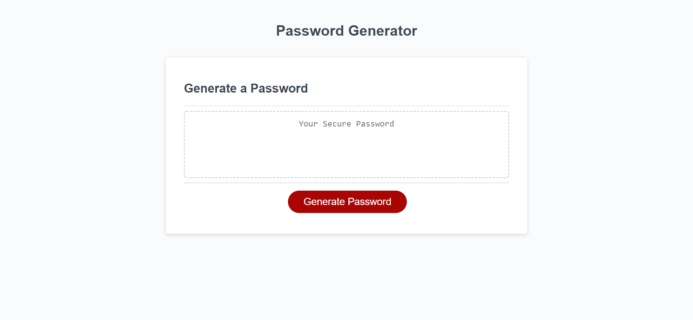

# Javascript Password Generator Challenge 3

# Description

For this challenge, we were tasked with writing the function to generate a random password using Javascript functions. We were given the HTML, CSS, and initial Javascript structure so we were able to focus solely building the function for generating the password. This included prompts for the user asking what length they would like their password to be and what types of characters they'd like to include. Additionally, I built in alerts for the user if they chose a password length outside the accepted bounds and if they declined to choose any group of characters.

# Live Link

[LIVELINK](https://tyleresselman.github.io/js-password-generator-ch-3/)

# Screenshot

# Credits

I collaborated with my classmates Joseph Ruiz, Jordan Harris, and TA's Paul Cwik and Samuel Adams on the pseudocode for this app.

# License

The MIT License (MIT)